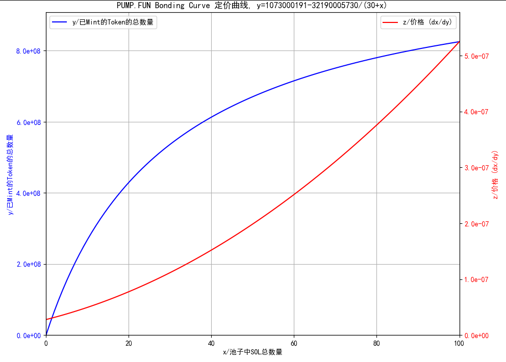

## 运行

- `poetry install`
- `python3 bonding_curve.py`

## Bonding Curve 曲线(Pump.fun)

- $y = 1073000191 - \frac{32190005730}{30+x}$
  - `x`: 池子中的SOL
  - `y`: 已mint的Token数量

- $z = \frac{\mathrm{d} x}{\mathrm{d} y} = \frac{(30 + x)^2}{32190005730}$
  - z是价格,即 ${(\frac{\mathrm{d}{y}}{\mathrm{d}{x}})}^{-1}$

## 参考

- [PUMP.FUN 协议洞察：从Bonding Curve计算到盈利策略构建](https://coinmarketcap.com/community/zh/articles/6662b0fa1cb3e93ee19e7bc5/)

