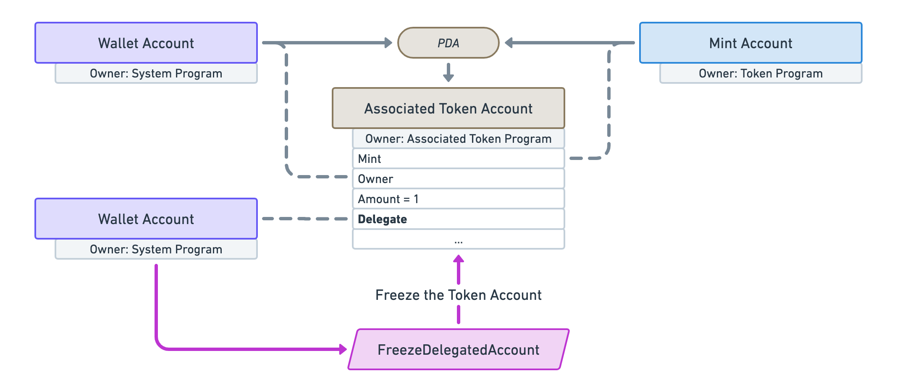
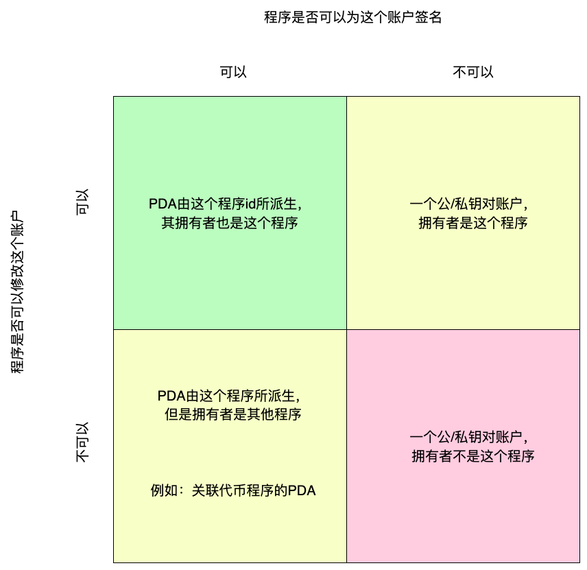
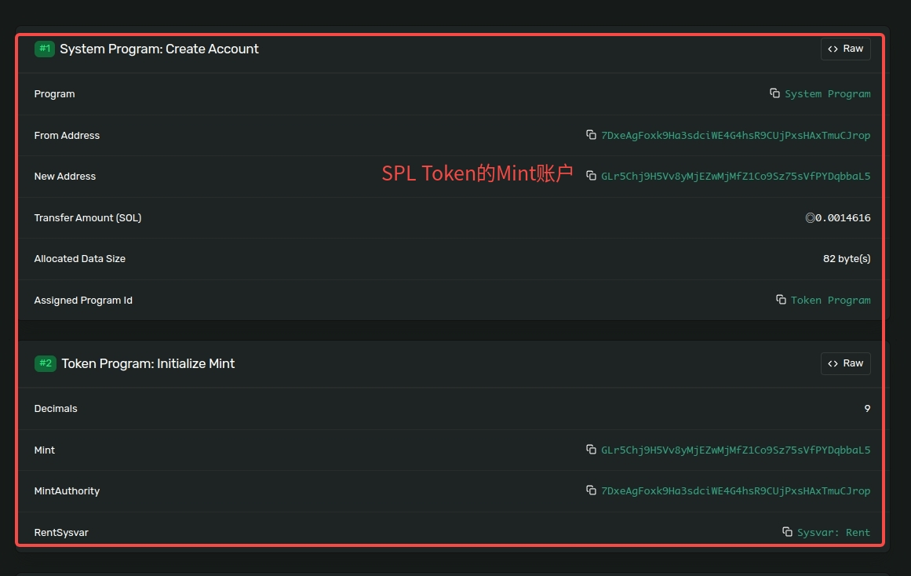

# Solana开发学习

> 官方文档：https://solana.com/docs/core/accounts
> https://solanazh.com


## Solana核心概念

> https://www.solanazh.com/course/1-2


- Account:
  - 官方文档： https://solana.com/docs/core/accounts
  - 在Solana中，"Everythin is an Account" 类似Linux世界里面把所有的资源都抽象成"文件"一样。

    ```rust
    pub struct Account {
        /// 账户余额
        /// lamports in the account
        pub lamports: u64,


        // 合约数据
        /// data held in this account
        #[serde(with = "serde_bytes")]
        pub data: Vec<u8>,

        // 所有者
        /// the program that owns this account. If executable, the program that loads this account.
        pub owner: Pubkey,

        // 是否可执行
        /// this account's data contains a loaded program (and is now read-only)
        pub executable: bool,


        /// the epoch at which this account will next owe rent
        pub rent_epoch: Epoch,
    }
    ```

- 账户和签名:
  - Solana的签名系统使用的是 Ed25519
    - 公钥 ---Base58---> 地址

- 交易: 是对多个交易指令的打包，所以起内容主要就是各个交易指令，以及相应指令对应的发起人和签名。

  ```rust
  pub struct Message {
        /// The message header, identifying signed and read-only `account_keys`.
        /// Header values only describe static `account_keys`, they do not describe
        /// any additional account keys loaded via address table lookups.
        pub header: MessageHeader,

        // 所有的需要使用到的程序集合
        /// List of accounts loaded by this transaction.
        #[serde(with = "short_vec")]
        pub account_keys: Vec<Pubkey>,

        /// The blockhash of a recent block.
        pub recent_blockhash: Hash,


        // 指令合集
        /// Instructions that invoke a designated program, are executed in sequence,
        /// and committed in one atomic transaction if all succeed.
        ///
        /// # Notes
        ///
        /// Program indexes must index into the list of message `account_keys` because
        /// program id's cannot be dynamically loaded from a lookup table.
        ///
        /// Account indexes must index into the list of addresses
        /// constructed from the concatenation of three key lists:
        ///   1) message `account_keys`
        ///   2) ordered list of keys loaded from `writable` lookup table indexes
        ///   3) ordered list of keys loaded from `readable` lookup table indexes
        #[serde(with = "short_vec")]
        pub instructions: Vec<CompiledInstruction>,

        /// List of address table lookups used to load additional accounts
        /// for this transaction.
        #[serde(with = "short_vec")]
        pub address_table_lookups: Vec<MessageAddressTableLookup>,
    }

    pub enum VersionedMessage {
        Legacy(LegacyMessage),
        V0(v0::Message),
    }

    pub struct VersionedTransaction {
        /// List of signatures
        #[serde(with = "short_vec")]
        pub signatures: Vec<Signature>,
        /// Message to sign.
        pub message: VersionedMessage,
    }
  ```

- 交易指令
  ```rust
  pub struct CompiledInstruction {

        // 索引
        /// Index into the transaction keys array indicating the program account that executes this instruction.
        pub program_id_index: u8,

        // 需要和合约交互账户
        /// Ordered indices into the transaction keys array indicating which accounts to pass to the program.
        #[serde(with = "short_vec")]
        pub accounts: Vec<u8>,

        // 输入数据
        /// The program input data.
        #[serde(with = "short_vec")]
        pub data: Vec<u8>,
    }
  ```

- 合约
  - 普通合约:
    - 普通合约是由用户开发并部署，Solana官方也有 一些官方开发的合约，如Token、ATA账号等合   约
  - 系统合约:
    - System Program: 创建账号，转账等作用
    - BPF Loader Program: 部署和更新合约
    - Vote program: 创建并管理用户POS代理投票的状态和奖励


- Account的所有权
  - 在上面的Account介绍中，我们有个owner的成员，这个就表示这个Account是被哪个合约管理的，或者说哪个 合约可以对这个Account进行读写，类似Linux操作系统中，文件属于哪个用户。

    - 例如： https://solscan.io/account/TokenkegQfeZyiNwAJbNbGKPFXCWuBvf9Ss623VQ5DA

        ```bash
        curl http://api.mainnet-beta.solana.com -X POST -H "Content-Type: application/json" -d '
        {
        "jsonrpc": "2.0",
        "id": 1,
        "method": "getAccountInfo",
        "params": [
            "6oE6pwEfq9XKjyuQ4M9Qx1qj5gkwf96Bc3GnLH36QaXn",
            {"encoding": "jsonParsed"}
        ]
        }
        '
        ```
    - 响应:
        ```json
        {
            "jsonrpc": "2.0",
            "result": {
                "context": {
                "apiVersion": "1.18.15",
                "slot": 275171657
                },
                "value": {
                "data": {
                    "parsed": {
                    "info": {
                        "decimals": 6,
                        "freezeAuthority": null,
                        "isInitialized": true,
                        "mintAuthority": null,
                        "supply": "1000000000000000"
                    },
                    "type": "mint"
                    },
                    "program": "spl-token",
                    "space": 82
                },
                "executable": false,
                "lamports": 1461600,
                "owner": "TokenkegQfeZyiNwAJbNbGKPFXCWuBvf9Ss623VQ5DA",
                "rentEpoch": 18446744073709551615,
                "space": 82
                }
            },
            "id": 1
        }
        ```

- 租约
  - Solana的资金模型中，每个 Solana 账户在区块链上存储数据的费用称为“租金”。
  - 所有 Solana 账户（以及计划）都需要保持足够高的 LAMPORT 余额，才能免除租金并保留在 Solana 区块链上。
  - 当帐户不再有足够的 LAMPORTS 来支付租金时，它将通过称为垃圾收集的过程从网络中删除。

- 租金率
  - 目前，租金率为静态金额并存储在 Rent 系统变量中。


## SPL代币

> https://www.solanazh.com/course/1-3

- SPL代币，类似以太坊中的ERC20代币
- SPL Token是 " Solana Program Library"中的一个组成部分，叫做"Token Program"，简称为SPL Token。

- SPL Token中，一个代币，仅仅是一个归Token合约管理的普通的Account对象，这个对象里面的二进制数据定义了 这个代币的基本属性。


- SPL Token 2个关键账户数据结构： `Mint` 和 `Account`
  - `Mint`账户数据结构
    - https://github.com/solana-labs/solana-program-library/tree/master/token/program-2022/src/state.rs

        ```rust
        /// Mint data.
        #[repr(C)]
        #[derive(Clone, Copy, Debug, Default, PartialEq)]
        pub struct Mint {
            // 增发权限
            /// Optional authority used to mint new tokens. The mint authority may only
            /// be provided during mint creation. If no mint authority is present
            /// then the mint has a fixed supply and no further tokens may be
            /// minted.
            pub mint_authority: COption<Pubkey>,

            // 总量
            /// Total supply of tokens.
            pub supply: u64,

            // 精度
            /// Number of base 10 digits to the right of the decimal place.
            pub decimals: u8,

            // 初始化
            /// Is `true` if this structure has been initialized
            pub is_initialized: bool,

            // 冻结账户权限(黑名单？)
            /// Optional authority to freeze token accounts.
            pub freeze_authority: COption<Pubkey>,
        }
        ```

  -  `Account`结构 (也可以叫 ATA(Associated Token Account))

        > 注意和Solana底层数据结构的Account做区分，Solana底层的Account可以称作 Wallet Account 。而

        ```rust
        /// Account data.
        #[repr(C)]
        #[derive(Clone, Copy, Debug, Default, PartialEq)]
        pub struct Account {
            // 指向上面的 Mint账户
            /// The mint associated with this account
            pub mint: Pubkey,

            // 一般是普通钱包用户，也可以是PDA账户
            /// The owner of this account.
            pub owner: Pubkey,

            // token的余额
            /// The amount of tokens this account holds.
            pub amount: u64,

            // 委托账户
            /// If `delegate` is `Some` then `delegated_amount` represents
            /// the amount authorized by the delegate
            pub delegate: COption<Pubkey>,

            // 账户状态
            /// The account's state
            pub state: AccountState,

            // 是否原生token, 例如 wrapped SOL
            /// If is_some, this is a native token, and the value logs the rent-exempt
            /// reserve. An Account is required to be rent-exempt, so the value is
            /// used by the Processor to ensure that wrapped SOL accounts do not
            /// drop below this threshold.
            pub is_native: COption<u64>,

            // 委托金额
            /// The amount delegated
            pub delegated_amount: u64,

            // 关闭权限
            /// Optional authority to close the account.
            pub close_authority: COption<Pubkey>,
        }
        ```

  - Mint 和 Account的关系
    - PDA (Program Dervied Address): 程序派生账户
    - ATA(Associated Token Account): 即 SPL Token的 Account, 见上面的`Account`的结构体
    - Mint Account: 即SPL Token 的 Mint, 见上面`Mint` 结构体

    


## 深入理解Solana的账户模型(核心)

> https://solanacookbook.com/zh/core-concepts/pdas.html#%E7%BB%BC%E8%BF%B0

- "一个公/私钥对账户"：就是普通用户的钱包账户
- "程序": 即合约
- "PDA": 程序派生出来的账户
- "拥有者": owner




## 安装solana命令行
> https://www.solanazh.com/course/1-4

- `sh -c "$(curl -sSfL https://release.solana.com/stable/install)"`
- 查看版本 `solana --version`
- 查看最新版本：https://github.com/solana-labs/solana/releases
- 更新到最新稳定版： `solana-install-init 1.18.15`


- 设置环境： `solana config set --url https://api.devnet.solana.com`
  - 官方RPC地址分别是：
    - DevNet: https://api.devnet.solana.com
    - TestNet: https://api.testnet.solana.com
    - MainNet: https://api.mainnet-beta.solana.com

- dev开发环境:
  - 地址： 7DxeAgFoxk9Ha3sdciWE4G4hsR9CUjPxsHAxTmuCJrop
  - 配置文件: `/home/yqq/.config/solana/cli/config.yml`
  - `/home/yqq/.config/solana/id.json`

    ```
    dinosaur domain jelly echo mountain cause drastic slab know dance ready open
    ```

  - 查看地址： `solana-keygen pubkey /home/yqq/.config/solana/id.json`
  - 水龙头:
    - https://faucet.solana.com/
    - https://solfaucet.com/
  - 查看地址余额: `solana balance -k /home/yqq/.config/solana/id.json`
  - 区块浏览器查看余额: https://explorer.solana.com/address/7DxeAgFoxk9Ha3sdciWE4G4hsR9CUjPxsHAxTmuCJrop?cluster=devnet

  - 转账: `solana transfer --allow-unfunded-recipient devwuNsNYACyiEYxRNqMNseBpNnGfnd4ZwNHL7sphqv 0.001 -k /home/yqq/.config/solana/id.json`
  - 查看转账交易: https://explorer.solana.com/tx/5Menvb9eNuVSUCXTiSnMYxAEW55pcJeMPYZtuhEeBVtzdyuFZdDMTK23cSWZpqCSo6WZo61z1nieyS4LcNYY2Mv2?cluster=devnet

## 使用钱包
> https://www.solanazh.com/course/1-5

- Phantom钱包： https://chrome.google.com/webstore/detail/phantom/bfnaelmomeimhlpmgjnjophhpkkoljpa

- 导入助记词： `dinosaur domain jelly echo mountain cause drastic slab know dance ready open`
  - 选择devnet,  这里地址和命令行地址不同, 应该是phantom派生的路径不一样
  - 通过水龙头获取sol,
  - 使用钱包进行转账： https://explorer.solana.com/tx/46MhN6ynPEzSMCXSShr9cbdx7CrYZBo78H4ctf4bge2uxrSfh72Ht499XwuNCeuxSypiCpa3vFDWK3gYfamuU5Kq?cluster=devnet


## 使用命令行发行SPL Token

> https://www.solanazh.com/course/1-6


- 创建SPL token： `spl-token create-token -C /home/yqq/.config/solana/cli/config.yml`

    ```
    $ spl-token create-token -C /home/yqq/.config/solana/cli/config.yml
    Creating token GLr5Chj9H5Vv8yMjEZwMjMfZ1Co9Sz75sVfPYDqbbaL5 under program TokenkegQfeZyiNwAJbNbGKPFXCWuBvf9Ss623VQ5DA

    Address:  GLr5Chj9H5Vv8yMjEZwMjMfZ1Co9Sz75sVfPYDqbbaL5
    Decimals:  9

    Signature: 2GKwsmWbevv6rUFGAQ3ZRSshdYJ5z69YgjaJUYqiSFT3yuw2mutkRBF88fP3D4HEG6eKpKDsf6oX1xVRavAcE8sf
    ```
    交易： https://explorer.solana.com/tx/2GKwsmWbevv6rUFGAQ3ZRSshdYJ5z69YgjaJUYqiSFT3yuw2mutkRBF88fP3D4HEG6eKpKDsf6oX1xVRavAcE8sf?cluster=devnet

    
    - 其中的新地址`GLr5Chj9H5Vv8yMjEZwMjMfZ1Co9Sz75sVfPYDqbbaL5` 就是 SPL Token的Mint账户(查看上述SPL Token 的2个关键账户数据结构， Mint 和Account)

- 创建 SPL Token Account  (ATA, Associated Token Account): `spl-token create-account GLr5Chj9H5Vv8yMjEZwMjMfZ1Co9Sz75sVfPYDqbbaL5 -C /home/yqq/.config/solana/cli/config.yml`

    ```
    $ spl-token create-account GLr5Chj9H5Vv8yMjEZwMjMfZ1Co9Sz75sVfPYDqbbaL5 -C /home/yqq/.config/solana/cli/config.yml
    Creating account FZQ6qrSHTPERXoQC9tp1WESVpzhZjugLMyQaHmg1BHmx

    Signature: 4ww8QgwSDbWtHE4Z597zLF2xuQoHfivxyWm1WXt8yAMyfpGcykbpbki3H5mJvPtk4gSZgobBBotJxmxLFjVpF2Hb
    ```
    交易：https://explorer.solana.com/tx/4ww8QgwSDbWtHE4Z597zLF2xuQoHfivxyWm1WXt8yAMyfpGcykbpbki3H5mJvPtk4gSZgobBBotJxmxLFjVpF2Hb?cluster=devnet


    - 其中 `FZQ6qrSHTPERXoQC9tp1WESVpzhZjugLMyQaHmg1BHmx` 就是ATA账号

- mint代币到ATA账号 `spl-token mint GLr5Chj9H5Vv8yMjEZwMjMfZ1Co9Sz75sVfPYDqbbaL5  100 FZQ6qrSHTPERXoQC9tp1WESVpzhZjugLMyQaHmg1BHmx -C /home/yqq/.config/solana/cli/config.yml`


    ```
    $ spl-token mint GLr5Chj9H5Vv8yMjEZwMjMfZ1Co9Sz75sVfPYDqbbaL5  100 FZQ6qrSHTPERXoQC9tp1WESVpzhZjugLMyQaHmg1BHmx -C /home/yqq/.config/solana/cli/config.yml
    Minting 100 tokens
    Token: GLr5Chj9H5Vv8yMjEZwMjMfZ1Co9Sz75sVfPYDqbbaL5
    Recipient: FZQ6qrSHTPERXoQC9tp1WESVpzhZjugLMyQaHmg1BHmx

    Signature: 2iCGoBkVQqgAqphXwKMJ9BXdjrrfwGDJEggFCPDGXJaPhRRiPjMvCs3Vsvg41mccntF8WiZiJ7VTwYX8P1YMbZGj
    ```

    交易：https://explorer.solana.com/tx/2iCGoBkVQqgAqphXwKMJ9BXdjrrfwGDJEggFCPDGXJaPhRRiPjMvCs3Vsvg41mccntF8WiZiJ7VTwYX8P1YMbZGj?cluster=devnet

- 查看代币余额: `spl-token balance GLr5Chj9H5Vv8yMjEZwMjMfZ1Co9Sz75sVfPYDqbbaL5 -C /home/yqq/.config/solana/cli/config.yml`
  - 这里会自动计算钱包账户对应的Token的ATA账户，因此不用指定ATA账户

    ```
    $ spl-token balance GLr5Chj9H5Vv8yMjEZwMjMfZ1Co9Sz75sVfPYDqbbaL5 -C /home/yqq/.config/solana/cli/config.yml
    100
    ```

- 转移SPL Token:  `spl-token transfer --fund-recipient  GLr5Chj9H5Vv8yMjEZwMjMfZ1Co9Sz75sVfPYDqbbaL5 1 38jEaxphBTa3NEg4K6nG8Zgs6eVsSsr9AoSZCfax2pH8 -C /home/yqq/.config/solana/cli/config.yml `


    ```
    $ spl-token transfer --fund-recipient  GLr5Chj9H5Vv8yMjEZwMjMfZ1Co9Sz75sVfPYDqbbaL5 1 38jEaxphBTa3NEg4K6nG8Zgs6eVsSsr9AoSZCfax2pH8 -C /home/yqq/.config/solana/cli/config.yml
    Transfer 1 tokens
    Sender: FZQ6qrSHTPERXoQC9tp1WESVpzhZjugLMyQaHmg1BHmx
    Recipient: 38jEaxphBTa3NEg4K6nG8Zgs6eVsSsr9AoSZCfax2pH8
    Recipient associated token account: 8gDUi1gMxy95WaMr5Phtmv8HoX52m5vw7t3Tum22n9hi
    Funding recipient: 8gDUi1gMxy95WaMr5Phtmv8HoX52m5vw7t3Tum22n9hi

    Signature: 4FUtCxJtinHJRDVuodm34fY15mBftbawhXEHD3qrvFKHK7hSiYXa4RrC3XgQBbcAK2H35VRXvuWZuP4eLMWV6b5i
    ```

    交易：https://explorer.solana.com/tx/4FUtCxJtinHJRDVuodm34fY15mBftbawhXEHD3qrvFKHK7hSiYXa4RrC3XgQBbcAK2H35VRXvuWZuP4eLMWV6b5i?cluster=devnet

    - 第一步：如果目的地址没有SPL Token的ATA账户，那么，先给目的地址创建一个SPL Token 的ATA账户,
      - 目的地址的ATA账户余额： https://explorer.solana.com/address/8gDUi1gMxy95WaMr5Phtmv8HoX52m5vw7t3Tum22n9hi?cluster=devnet
    - 第二步：进行SPL Token转移

- 再次查看余额: `spl-token balance GLr5Chj9H5Vv8yMjEZwMjMfZ1Co9Sz75sVfPYDqbbaL5 -C /home/yqq/.config/solana/cli/config.yml`


## RPC
> - https://www.solanazh.com/course/2-1
>
> - https://www.solanazh.com/course/2-2

- 3种区块`commitment`级别, 在请求查询的时候，对查询的结果有三种状态选择：
  - `processed`(处理中) : 节点将查询最新的区块。注意，该区块可能被集群跳过。
    - 前端界面可以使用这个状态，表示交易已经提交
  - `confirmed`(已确认) : 节点将查询由集群的超多数投票的最新区块。
    - 一般情况下使用这个状态
  - `finalized`(最终确认): 节点将查询由超过集群中超多数确认为达到最大封锁期的最新区块，表示集群已将此区块确认为已完成。
    - 涉及到转账，必须使用这个状态


- 常用RPC接口:

  - 获取区块高度
    ```
    $ curl https://api.devnet.solana.com -X POST -H "Content-Type: application/json" -s -d '
        {
            "jsonrpc":"2.0","id":1,
            "method":"getBlockHeight"
        }
        ' | jq
    {
    "jsonrpc": "2.0",
    "result": 297028601,
    "id": 1
    }
    ```


  - 获取最新区块hash
    ```
    curl https://api.devnet.solana.com -s -X POST -H "Content-Type: application/json" -d '
    {
        "id":1,
        "jsonrpc":"2.0",
        "method":"getLatestBlockhash",
        "params":[
        {
            "commitment":"processed"
        }
        ]
    }' | jq
    {
        "jsonrpc": "2.0",
        "result": {
            "context": {
            "apiVersion": "1.18.16",
            "slot": 308784440
            },
            "value": {
            "blockhash": "FnoWSdeD5QnZMbAEaxDVP3knGvqWej7FruDVFwJgSPdf",
            "lastValidBlockHeight": 297029261
            }
        },
        "id": 1
    }
    ```

  - 获取指定区块高度
  ```
  curl https://api.devnet.solana.com -s -X POST -H "Content-Type: application/json" -d '
    {
        "jsonrpc": "2.0","id":1,
        "method":"getBlock",
        "params": [
            174302734,
            {
                "encoding": "jsonParsed",
                "maxSupportedTransactionVersion":0,
                "transactionDetails":"full",
                "rewards":false
            }
        ]
    }' | jq
    ```

  - 获取指定block的确认状态
  ```
  curl https://api.devnet.solana.com -s -X POST -H "Content-Type: application/json" -d '
    {
        "jsonrpc": "2.0", "id": 1,
        "method": "getBlockCommitment",
        "params":[174302734]
    }
    ' | jq
  ```

  - 批量获取区块
  ```
  curl https://api.devnet.solana.com -s -X POST -H "Content-Type: application/json" -d '
    {
        "jsonrpc": "2.0", "id": 1,
        "method": "getBlocks",
        "params": [
            174302734, 174302735
        ]
    }
    ' | jq
  ```

  - 获取账户信息
  ```
  curl https://api.devnet.solana.com -s -X POST -H "Content-Type: application/json" -d '
    {
        "jsonrpc": "2.0",
        "id": 1,
        "method": "getAccountInfo",
        "params": [
            "7DxeAgFoxk9Ha3sdciWE4G4hsR9CUjPxsHAxTmuCJrop",
            {
                "encoding": "base58",
                "commitment": "finalized"
            }
        ]
    }
    ' | jq
    {
        "jsonrpc": "2.0",
        "result": {
            "context": {
            "apiVersion": "1.18.16",
            "slot": 308785669
            },
            "value": {
            "data": [
                "",
                "base58"
            ],
            "executable": false,
            "lamports": 6994429840,
            "owner": "11111111111111111111111111111111",
            "rentEpoch": 18446744073709551615,
            "space": 0
            }
        },
        "id": 1
    }
  ```
    - 所有普通账户的owner都是 系统根账号`11111111111111111111111111111111`


  - 获取账户余额

  ```
  curl https://api.devnet.solana.com -s -X POST -H "Content-Type: application/json" -d '
    {
        "jsonrpc": "2.0", "id": 1,
        "method": "getBalance",
        "params": [
            "7DxeAgFoxk9Ha3sdciWE4G4hsR9CUjPxsHAxTmuCJrop"
        ]
    }
    ' | jq
    {
        "jsonrpc": "2.0",
        "result": {
            "context": {
                "apiVersion": "1.18.16",
                "slot": 308787571
            },
            "value": 6994429840
        },
        "id": 1
    }
  ```
    - `6994429840 / 10^9 = 6.994429840 SOL`


  - 获取某个合约管理的所有Account
  ```
  curl  https://api.devnet.solana.com -s -X POST -H "Content-Type: application/json" -d '
        {
            "jsonrpc": "2.0",
            "id": 1,
            "method": "getProgramAccounts",
            "params": [
            "namesLPneVptA9Z5rqUDD9tMTWEJwofgaYwp8cawRkX",
            {
                "encoding": "jsonParsed",
                "filters": [
                {
                    "dataSize": 128
                }
                ]
            }
            ]
        }
    ' | jq
  ```

  - 查询SPL Token ATA账户信息
  ```
  curl  https://api.devnet.solana.com -s -X POST -H "Content-Type: application/json" -d '
        {
            "jsonrpc": "2.0",
            "id": 1,
            "method": "getTokenAccountsByOwner",
            "params": [
            "7DxeAgFoxk9Ha3sdciWE4G4hsR9CUjPxsHAxTmuCJrop",
            {
                "mint": "GLr5Chj9H5Vv8yMjEZwMjMfZ1Co9Sz75sVfPYDqbbaL5"
            },
            {
                "encoding": "jsonParsed"
            }
            ]
        }
    ' | jq

    {
        "jsonrpc": "2.0",
        "result": {
            "context": {
            "apiVersion": "1.18.16",
            "slot": 308789145
            },
            "value": [
            {
                "account": {
                "data": {
                    "parsed": {
                    "info": {
                        "isNative": false,
                        "mint": "GLr5Chj9H5Vv8yMjEZwMjMfZ1Co9Sz75sVfPYDqbbaL5",
                        "owner": "7DxeAgFoxk9Ha3sdciWE4G4hsR9CUjPxsHAxTmuCJrop",
                        "state": "initialized",
                        "tokenAmount": {
                        "amount": "99000000000",
                        "decimals": 9,
                        "uiAmount": 99.0,
                        "uiAmountString": "99"
                        }
                    },
                    "type": "account"
                    },
                    "program": "spl-token",
                    "space": 165
                },
                "executable": false,
                "lamports": 2039280,
                "owner": "TokenkegQfeZyiNwAJbNbGKPFXCWuBvf9Ss623VQ5DA",
                "rentEpoch": 18446744073709551615,
                "space": 165
                },
                "pubkey": "FZQ6qrSHTPERXoQC9tp1WESVpzhZjugLMyQaHmg1BHmx"
            }
            ]
        },
        "id": 1
    }
  ```

  - 查询Token Account(ATA)账户的余额
  ```
  curl  https://api.devnet.solana.com  -s -X POST -H "Content-Type: application/json" -d '
        {
            "jsonrpc": "2.0", "id": 1,
            "method": "getTokenAccountBalance",
            "params": [
                "FZQ6qrSHTPERXoQC9tp1WESVpzhZjugLMyQaHmg1BHmx"
            ]
        }
    ' | jq

    {
        "jsonrpc": "2.0",
        "result": {
            "context": {
            "apiVersion": "1.18.16",
            "slot": 308789587
            },
            "value": {
            "amount": "99000000000",
            "decimals": 9,
            "uiAmount": 99.0,
            "uiAmountString": "99"
            }
        },
        "id": 1
    }
  ```


  - 获取交易手续费

  ```
  curl https://api.devnet.solana.com -X POST -H "Content-Type: application/json" -d '
    {
        "id":1,
        "jsonrpc":"2.0",
        "method":"getFeeForMessage",
        "params":[
            "AQABAgIAAAAAAAAAAAAAAAAAAAAAAAAAAAAAAAAAAAAAAAAAAQAAAAAAAAAAAAAAAAAAAAAAAAAAAAAAAAAAAAAAAAAAAAAAAAAAAAAAAAAAAAAAAAAAAAAAAAAAAAAAAAAAAAEBAQAA",
            {
                "commitment":"processed"
            }
        ]
    }
    '
  ```

  - 获取交易详细信息
  ```
  curl  https://api.devnet.solana.com  -s -X POST -H "Content-Type: application/json" -d '
        {
            "jsonrpc": "2.0",
            "id": 1,
            "method": "getTransaction",
            "params": [
                "4FUtCxJtinHJRDVuodm34fY15mBftbawhXEHD3qrvFKHK7hSiYXa4RrC3XgQBbcAK2H35VRXvuWZuP4eLMWV6b5i",
                "jsonParsed"
            ]
        }
    ' | jq

    {
        "jsonrpc": "2.0",
        "result": {
            "blockTime": 1719787000,
            "meta": {
            "computeUnitsConsumed": 28320,
            "err": null,
            "fee": 5000,
            "innerInstructions": [
                {
                "index": 0,
                "instructions": [
                    {
                    "parsed": {
                        "info": {
                        "extensionTypes": [
                            "immutableOwner"
                        ],
                        "mint": "GLr5Chj9H5Vv8yMjEZwMjMfZ1Co9Sz75sVfPYDqbbaL5"
                        },
                        "type": "getAccountDataSize"
                    },
                    "program": "spl-token",
                    "programId": "TokenkegQfeZyiNwAJbNbGKPFXCWuBvf9Ss623VQ5DA",
                    "stackHeight": 2
                    },
                    {
                    "parsed": {
                        "info": {
                        "lamports": 2039280,
                        "newAccount": "8gDUi1gMxy95WaMr5Phtmv8HoX52m5vw7t3Tum22n9hi",
                        "owner": "TokenkegQfeZyiNwAJbNbGKPFXCWuBvf9Ss623VQ5DA",
                        "source": "7DxeAgFoxk9Ha3sdciWE4G4hsR9CUjPxsHAxTmuCJrop",
                        "space": 165
                        },
                        "type": "createAccount"
                    },
                    "program": "system",
                    "programId": "11111111111111111111111111111111",
                    "stackHeight": 2
                    },
                    {
                    "parsed": {
                        "info": {
                        "account": "8gDUi1gMxy95WaMr5Phtmv8HoX52m5vw7t3Tum22n9hi"
                        },
                        "type": "initializeImmutableOwner"
                    },
                    "program": "spl-token",
                    "programId": "TokenkegQfeZyiNwAJbNbGKPFXCWuBvf9Ss623VQ5DA",
                    "stackHeight": 2
                    },
                    {
                    "parsed": {
                        "info": {
                        "account": "8gDUi1gMxy95WaMr5Phtmv8HoX52m5vw7t3Tum22n9hi",
                        "mint": "GLr5Chj9H5Vv8yMjEZwMjMfZ1Co9Sz75sVfPYDqbbaL5",
                        "owner": "38jEaxphBTa3NEg4K6nG8Zgs6eVsSsr9AoSZCfax2pH8"
                        },
                        "type": "initializeAccount3"
                    },
                    "program": "spl-token",
                    "programId": "TokenkegQfeZyiNwAJbNbGKPFXCWuBvf9Ss623VQ5DA",
                    "stackHeight": 2
                    }
                ]
                }
            ],
            "logMessages": [
                "Program ATokenGPvbdGVxr1b2hvZbsiqW5xWH25efTNsLJA8knL invoke [1]",
                "Program log: CreateIdempotent",
                "Program TokenkegQfeZyiNwAJbNbGKPFXCWuBvf9Ss623VQ5DA invoke [2]",
                "Program log: Instruction: GetAccountDataSize",
                "Program TokenkegQfeZyiNwAJbNbGKPFXCWuBvf9Ss623VQ5DA consumed 1595 of 21337 compute units",
                "Program return: TokenkegQfeZyiNwAJbNbGKPFXCWuBvf9Ss623VQ5DA pQAAAAAAAAA=",
                "Program TokenkegQfeZyiNwAJbNbGKPFXCWuBvf9Ss623VQ5DA success",
                "Program 11111111111111111111111111111111 invoke [2]",
                "Program 11111111111111111111111111111111 success",
                "Program log: Initialize the associated token account",
                "Program TokenkegQfeZyiNwAJbNbGKPFXCWuBvf9Ss623VQ5DA invoke [2]",
                "Program log: Instruction: InitializeImmutableOwner",
                "Program log: Please upgrade to SPL Token 2022 for immutable owner support",
                "Program TokenkegQfeZyiNwAJbNbGKPFXCWuBvf9Ss623VQ5DA consumed 1405 of 14724 compute units",
                "Program TokenkegQfeZyiNwAJbNbGKPFXCWuBvf9Ss623VQ5DA success",
                "Program TokenkegQfeZyiNwAJbNbGKPFXCWuBvf9Ss623VQ5DA invoke [2]",
                "Program log: Instruction: InitializeAccount3",
                "Program TokenkegQfeZyiNwAJbNbGKPFXCWuBvf9Ss623VQ5DA consumed 4214 of 10840 compute units",
                "Program TokenkegQfeZyiNwAJbNbGKPFXCWuBvf9Ss623VQ5DA success",
                "Program ATokenGPvbdGVxr1b2hvZbsiqW5xWH25efTNsLJA8knL consumed 21998 of 28320 compute units",
                "Program ATokenGPvbdGVxr1b2hvZbsiqW5xWH25efTNsLJA8knL success",
                "Program TokenkegQfeZyiNwAJbNbGKPFXCWuBvf9Ss623VQ5DA invoke [1]",
                "Program log: Instruction: TransferChecked",
                "Program TokenkegQfeZyiNwAJbNbGKPFXCWuBvf9Ss623VQ5DA consumed 6172 of 6322 compute units",
                "Program TokenkegQfeZyiNwAJbNbGKPFXCWuBvf9Ss623VQ5DA success",
                "Program ComputeBudget111111111111111111111111111111 invoke [1]",
                "Program ComputeBudget111111111111111111111111111111 success"
            ],
            "postBalances": [
                6994429840,
                2039280,
                2039280,
                1,
                1,
                934087680,
                998985000,
                731913600,
                1461600
            ],
            "postTokenBalances": [
                {
                "accountIndex": 1,
                "mint": "GLr5Chj9H5Vv8yMjEZwMjMfZ1Co9Sz75sVfPYDqbbaL5",
                "owner": "38jEaxphBTa3NEg4K6nG8Zgs6eVsSsr9AoSZCfax2pH8",
                "programId": "TokenkegQfeZyiNwAJbNbGKPFXCWuBvf9Ss623VQ5DA",
                "uiTokenAmount": {
                    "amount": "1000000000",
                    "decimals": 9,
                    "uiAmount": 1.0,
                    "uiAmountString": "1"
                }
                },
                {
                "accountIndex": 2,
                "mint": "GLr5Chj9H5Vv8yMjEZwMjMfZ1Co9Sz75sVfPYDqbbaL5",
                "owner": "7DxeAgFoxk9Ha3sdciWE4G4hsR9CUjPxsHAxTmuCJrop",
                "programId": "TokenkegQfeZyiNwAJbNbGKPFXCWuBvf9Ss623VQ5DA",
                "uiTokenAmount": {
                    "amount": "99000000000",
                    "decimals": 9,
                    "uiAmount": 99.0,
                    "uiAmountString": "99"
                }
                }
            ],
            "preBalances": [
                6996474120,
                0,
                2039280,
                1,
                1,
                934087680,
                998985000,
                731913600,
                1461600
            ],
            "preTokenBalances": [
                {
                "accountIndex": 2,
                "mint": "GLr5Chj9H5Vv8yMjEZwMjMfZ1Co9Sz75sVfPYDqbbaL5",
                "owner": "7DxeAgFoxk9Ha3sdciWE4G4hsR9CUjPxsHAxTmuCJrop",
                "programId": "TokenkegQfeZyiNwAJbNbGKPFXCWuBvf9Ss623VQ5DA",
                "uiTokenAmount": {
                    "amount": "100000000000",
                    "decimals": 9,
                    "uiAmount": 100.0,
                    "uiAmountString": "100"
                }
                }
            ],
            "rewards": [],
            "status": {
                "Ok": null
            }
            },
            "slot": 308780317,
            "transaction": {
            "message": {
                "accountKeys": [
                {
                    "pubkey": "7DxeAgFoxk9Ha3sdciWE4G4hsR9CUjPxsHAxTmuCJrop",
                    "signer": true,
                    "source": "transaction",
                    "writable": true
                },
                {
                    "pubkey": "8gDUi1gMxy95WaMr5Phtmv8HoX52m5vw7t3Tum22n9hi",
                    "signer": false,
                    "source": "transaction",
                    "writable": true
                },
                {
                    "pubkey": "FZQ6qrSHTPERXoQC9tp1WESVpzhZjugLMyQaHmg1BHmx",
                    "signer": false,
                    "source": "transaction",
                    "writable": true
                },
                {
                    "pubkey": "11111111111111111111111111111111",
                    "signer": false,
                    "source": "transaction",
                    "writable": false
                },
                {
                    "pubkey": "ComputeBudget111111111111111111111111111111",
                    "signer": false,
                    "source": "transaction",
                    "writable": false
                },
                {
                    "pubkey": "TokenkegQfeZyiNwAJbNbGKPFXCWuBvf9Ss623VQ5DA",
                    "signer": false,
                    "source": "transaction",
                    "writable": false
                },
                {
                    "pubkey": "38jEaxphBTa3NEg4K6nG8Zgs6eVsSsr9AoSZCfax2pH8",
                    "signer": false,
                    "source": "transaction",
                    "writable": false
                },
                {
                    "pubkey": "ATokenGPvbdGVxr1b2hvZbsiqW5xWH25efTNsLJA8knL",
                    "signer": false,
                    "source": "transaction",
                    "writable": false
                },
                {
                    "pubkey": "GLr5Chj9H5Vv8yMjEZwMjMfZ1Co9Sz75sVfPYDqbbaL5",
                    "signer": false,
                    "source": "transaction",
                    "writable": false
                }
                ],
                "instructions": [
                {
                    "parsed": {
                    "info": {
                        "account": "8gDUi1gMxy95WaMr5Phtmv8HoX52m5vw7t3Tum22n9hi",
                        "mint": "GLr5Chj9H5Vv8yMjEZwMjMfZ1Co9Sz75sVfPYDqbbaL5",
                        "source": "7DxeAgFoxk9Ha3sdciWE4G4hsR9CUjPxsHAxTmuCJrop",
                        "systemProgram": "11111111111111111111111111111111",
                        "tokenProgram": "TokenkegQfeZyiNwAJbNbGKPFXCWuBvf9Ss623VQ5DA",
                        "wallet": "38jEaxphBTa3NEg4K6nG8Zgs6eVsSsr9AoSZCfax2pH8"
                    },
                    "type": "createIdempotent"
                    },
                    "program": "spl-associated-token-account",
                    "programId": "ATokenGPvbdGVxr1b2hvZbsiqW5xWH25efTNsLJA8knL",
                    "stackHeight": null
                },
                {
                    "parsed": {
                    "info": {
                        "authority": "7DxeAgFoxk9Ha3sdciWE4G4hsR9CUjPxsHAxTmuCJrop",
                        "destination": "8gDUi1gMxy95WaMr5Phtmv8HoX52m5vw7t3Tum22n9hi",
                        "mint": "GLr5Chj9H5Vv8yMjEZwMjMfZ1Co9Sz75sVfPYDqbbaL5",
                        "source": "FZQ6qrSHTPERXoQC9tp1WESVpzhZjugLMyQaHmg1BHmx",
                        "tokenAmount": {
                        "amount": "1000000000",
                        "decimals": 9,
                        "uiAmount": 1.0,
                        "uiAmountString": "1"
                        }
                    },
                    "type": "transferChecked"
                    },
                    "program": "spl-token",
                    "programId": "TokenkegQfeZyiNwAJbNbGKPFXCWuBvf9Ss623VQ5DA",
                    "stackHeight": null
                },
                {
                    "accounts": [],
                    "data": "JBudM9",
                    "programId": "ComputeBudget111111111111111111111111111111",
                    "stackHeight": null
                }
                ],
                "recentBlockhash": "B8ceGW8TLHfJEqHTBguWdcn5CVUGQy1yKfaBgH2Vg5KS"
            },
            "signatures": [
                "4FUtCxJtinHJRDVuodm34fY15mBftbawhXEHD3qrvFKHK7hSiYXa4RrC3XgQBbcAK2H35VRXvuWZuP4eLMWV6b5i"
            ]
            }
        },
        "id": 1
    }

  ```

## Websocket订阅

> https://www.solanazh.com/course/2-3

- Solana主要订阅方法：
  - `accountSubscribe` : 订阅Account的变化，比如lamports
  - `logsSubscribe` : 订阅合约交易的日志
  - `programSubscribe` ： 订阅合约Account的变化
  - `signatureSubscribe` : 订阅签名状态变化
  - `slotSubscribe` : 订阅slot的变化


- 安装websocket工具: `npm install -g ws wscat`


- 订阅Account变化: `accountSubscribe`

    - 建立ws连接: `wscat -c wss://api.devnet.solana.com`

    在另外一个控制台转移token
    ```
    $ spl-token transfer --fund-recipient  GLr5Chj9H5Vv8yMjEZwMjMfZ1Co9Sz75sVfPYDqbbaL5 1 38jEaxphBTa3NEg4K6nG8Zgs6eVsSsr9AoSZCfax2pH8 -C /home/yqq/.config/solana/cli/config.yml
    ```


    ```
    $ wscat -c wss://api.devnet.solana.com
    Connected (press CTRL+C to quit)
    > {"jsonrpc":"2.0","id":1,"method":"accountSubscribe","params":["FZQ6qrSHTPERXoQC9tp1WESVpzhZjugLMyQaHmg1BHmx",{"encoding":"jsonParsed","commitment":"finalized"}]}
    < {"jsonrpc":"2.0","result":16749,"id":1}
    < {"jsonrpc":"2.0","method":"accountNotification","params":{"result":{"context":{"slot":308791519},"value":{"lamports":2039280,"data":{"program":"spl-token","parsed":{"info":{"isNative":false,"mint":"GLr5Chj9H5Vv8yMjEZwMjMfZ1Co9Sz75sVfPYDqbbaL5","owner":"7DxeAgFoxk9Ha3sdciWE4G4hsR9CUjPxsHAxTmuCJrop","state":"initialized","tokenAmount":{"amount":"97000000000","decimals":9,"uiAmount":97.0,"uiAmountString":"97"}},"type":"account"},"space":165},"owner":"TokenkegQfeZyiNwAJbNbGKPFXCWuBvf9Ss623VQ5DA","executable":false,"rentEpoch":18446744073709551615,"space":165}},"subscription":16749}}
    >
    ```


- 订阅日志: `logsSubscribe`

```
{"jsonrpc":"2.0","id":1,"method":"logsSubscribe","params":[{"mentions":["GLr5Chj9H5Vv8yMjEZwMjMfZ1Co9Sz75sVfPYDqbbaL5"]},{"commitment":"finalized"}]}
```

在另外一个控制台mint SPL token, 触发日志
```
$ spl-token mint GLr5Chj9H5Vv8yMjEZwMjMfZ1Co9Sz75sVfPYDqbbaL5  100 FZQ6qrSHTPERXoQC9tp1WESVpzhZjugLMyQaHmg1BHmx -C /home/yqq/.config/solana/cli/config.yml
Minting 100 tokens
  Token: GLr5Chj9H5Vv8yMjEZwMjMfZ1Co9Sz75sVfPYDqbbaL5
  Recipient: FZQ6qrSHTPERXoQC9tp1WESVpzhZjugLMyQaHmg1BHmx

Signature: orDWbEWTVAfbPVXxa3VBcdTUR41xm38ssGcy4BFFXspK5rmAPQ7F8oSJ5Kk2dYtzoTuZZSWRuPvUVrA6tYiMdWN
```


```
$ wscat -c wss://api.devnet.solana.com
Connected (press CTRL+C to quit)
> {"jsonrpc":"2.0","id":1,"method":"logsSubscribe","params":[{"mentions":["GLr5Chj9H5Vv8yMjEZwMjMf
< {"jsonrpc":"2.0","error":{"code":-32700,"message":"Parse error"},"id":null}
> {"jsonrpc":"2.0","id":1,"method":"logsSubscribe","params":[{"mentions":["GLr5Chj9H5Vv8yMjEZwMjMfZ1Co9Sz75sVfPYDqbbaL5"]},{"commitment":"finalized"}]}
< {"jsonrpc":"2.0","result":17045,"id":1}
< {"jsonrpc":"2.0","method":"logsNotification","params":{"result":{"context":{"slot":308792678},"value":{"signature":"1111111111111111111111111111111111111111111111111111111111111111","err":null,"logs":["Program TokenkegQfeZyiNwAJbNbGKPFXCWuBvf9Ss623VQ5DA invoke [1]","Program log: Instruction: MintToChecked","Program TokenkegQfeZyiNwAJbNbGKPFXCWuBvf9Ss623VQ5DA consumed 4498 of 1400000 compute units","Program TokenkegQfeZyiNwAJbNbGKPFXCWuBvf9Ss623VQ5DA success","Program ComputeBudget111111111111111111111111111111 invoke [1]","Program ComputeBudget111111111111111111111111111111 success"]}},"subscription":17045}}
< {"jsonrpc":"2.0","method":"logsNotification","params":{"result":{"context":{"slot":308792678},"value":{"signature":"orDWbEWTVAfbPVXxa3VBcdTUR41xm38ssGcy4BFFXspK5rmAPQ7F8oSJ5Kk2dYtzoTuZZSWRuPvUVrA6tYiMdWN","err":null,"logs":["Program TokenkegQfeZyiNwAJbNbGKPFXCWuBvf9Ss623VQ5DA invoke [1]","Program log: Instruction: MintToChecked","Program TokenkegQfeZyiNwAJbNbGKPFXCWuBvf9Ss623VQ5DA consumed 4498 of 4648 compute units","Program TokenkegQfeZyiNwAJbNbGKPFXCWuBvf9Ss623VQ5DA success","Program ComputeBudget111111111111111111111111111111 invoke [1]","Program ComputeBudget111111111111111111111111111111 success"]}},"subscription":17045}}
< {"jsonrpc":"2.0","method":"logsNotification","params":{"result":{"context":{"slot":308792680},"value":{"signature":"orDWbEWTVAfbPVXxa3VBcdTUR41xm38ssGcy4BFFXspK5rmAPQ7F8oSJ5Kk2dYtzoTuZZSWRuPvUVrA6tYiMdWN","err":null,"logs":["Program TokenkegQfeZyiNwAJbNbGKPFXCWuBvf9Ss623VQ5DA invoke [1]","Program log: Instruction: MintToChecked","Program TokenkegQfeZyiNwAJbNbGKPFXCWuBvf9Ss623VQ5DA consumed 4498 of 4648 compute units","Program TokenkegQfeZyiNwAJbNbGKPFXCWuBvf9Ss623VQ5DA success","Program ComputeBudget111111111111111111111111111111 invoke [1]","Program ComputeBudget111111111111111111111111111111 success"]}},"subscription":17045}}
```


- 订阅合约所属于Account事件: `programSubscribe`

    `{"jsonrpc":"2.0","id":1,"method":"programSubscribe","params":["GLr5Chj9H5Vv8yMjEZwMjMfZ1Co9Sz75sVfPYDqbbaL5",{"encoding":"jsonParsed"}]}`


- 订阅交易状态: `signatureSubscribe`

    ```
    {
        "jsonrpc": "2.0",
        "id": 1,
        "method": "signatureSubscribe",
        "params": [
                "BfQAbgqQZMfsxFHwh6Hve8yGb843QfZcYtD2j2nN3K1hLHZrQjzdwG9uWgNkGXs4tBNVLE3JAzvNLtwJBt3zDsN",
                {
                "commitment": "finalized",
                "enableReceivedNotification": false
                }
            ]
    }
    ```

## solana-web3.js 使用

> https://solana.com/docs/clients/javascript-reference

- `yarn add @solana/web3.js`
- https://solana-labs.github.io/solana-web3.js/classes/Connection.html


- 进行 SOL 转账

    ```js
    const web3 = require("@solana/web3.js");
    const fs = require("fs");

    async function main() {
    let payer = web3.Keypair.fromSecretKey(
        Uint8Array.from(
        JSON.parse(fs.readFileSync("/home/yqq/.config/solana/id.json"))
        )
    );
    console.log(payer);

    let connection = new web3.Connection(
        web3.clusterApiUrl("devnet"),
        "confirmed"
    );

    console.log(payer.publicKey.toString());

    let toAccount = new web3.PublicKey(
        "38jEaxphBTa3NEg4K6nG8Zgs6eVsSsr9AoSZCfax2pH8"
    );

    // Create Simple Transaction
    let transaction = new web3.Transaction();

    // Add an instruction to execute
    transaction.add(
        web3.SystemProgram.transfer({
        fromPubkey: payer.publicKey,
        toPubkey: toAccount,
        lamports: 1000,
        })
    );

    // Send and confirm transaction
    // Note: feePayer is by default the first signer, or payer, if the parameter is not set
    try {
        const signature = await web3.sendAndConfirmTransaction(
        connection,
        transaction,
        [payer]
        );
        console.log("signature: ", signature);
    } catch (error) {
        console.error("Error sending transaction", error);
    }
    }

    main().catch((error) => {
        console.error(error);
        process.exitCode = 1;
    });
    ```

- 进行 SPL Token的转移 [spl-token-demo](./demos/spl-token-demo)
  - 基于 react 前端实现
  - 直接使用 `@solana/spl-token` 会报错


