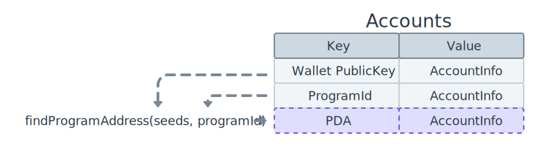
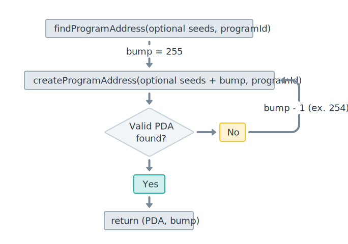

# PDA地址

> https://solana.com/docs/core/pda

### 关键点

- 通过自定义的`seed` + `bump seed` +  `programId` 派生出来
- PDA不会自动被创建，必须显示通过程序中的指令来创建PDA账户
- PDA 落在Ed25519曲线之外，并且没有对应的私钥
  -
- 程序可以为自己派生出来的PDA"签名"(达到签名的效果，并不是普通账户的签名 ),不需要私钥

    

- PDA地址是在ed25519曲线之外的，因此，PDA没有对应的私钥。

- PDA也是确定的, 而不是随机的，因为输入的信息都是预先确定的

- PDA可以作为链上账户的地址，用来存储状态和获取程序状态
    

- PDA账户如果已经被创建，不能重复创建，否则交易失败

### 如何生成PDA

  