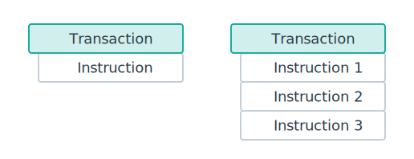

# Solana的交易和指令

> https://solana.com/docs/core/transactions


关键细节：
- **执行顺序**： 如果交易包含多个指令，按照顺序执行（指令添加到交易中的顺序）
- **原子性**： 交易是原子性，只有当全部指令都执行成功，交易才成功，否则交易执行失败




关键点:

- 交易由不同指令组成，这些指令用来与链上不同的程序进行交互， 不同的指令代表不同的操作
- 每个指令指定3个要素, 见下文的`CompiledInstruction`结构体：
  - 程序id索引
  - 账户列表, 即指令所涉及的账户
  - 输入数据
- 交易中的指令，按照顺序执行
- 交易是原子性的
- 一笔交易最大为**1232 bytes**
  - Solana最大传输单元是1280字节, 这个值跟IPV6的MTU(最小传输单元) 一样， 为了UDP传输的效率。 详细见： https://solana.com/docs/core/transactions#transaction-size


- Message

    ```rust
    pub struct Message {
            /// The message header, identifying signed and read-only `account_keys`.
            /// Header values only describe static `account_keys`, they do not describe
            /// any additional account keys loaded via address table lookups.
            pub header: MessageHeader,

            // 所有的需要使用到的程序集合
            /// List of accounts loaded by this transaction.
            #[serde(with = "short_vec")]
            pub account_keys: Vec<Pubkey>,

            /// The blockhash of a recent block.
            pub recent_blockhash: Hash,


            // 指令合集
            /// Instructions that invoke a designated program, are executed in sequence,
            /// and committed in one atomic transaction if all succeed.
            ///
            /// # Notes
            ///
            /// Program indexes must index into the list of message `account_keys` because
            /// program id's cannot be dynamically loaded from a lookup table.
            ///
            /// Account indexes must index into the list of addresses
            /// constructed from the concatenation of three key lists:
            ///   1) message `account_keys`
            ///   2) ordered list of keys loaded from `writable` lookup table indexes
            ///   3) ordered list of keys loaded from `readable` lookup table indexes
            #[serde(with = "short_vec")]
            pub instructions: Vec<CompiledInstruction>,

            /// List of address table lookups used to load additional accounts
            /// for this transaction.
            #[serde(with = "short_vec")]
            pub address_table_lookups: Vec<MessageAddressTableLookup>,
        }

        pub enum VersionedMessage {
            Legacy(LegacyMessage),
            V0(v0::Message),
        }

        pub struct VersionedTransaction {
            /// List of signatures
            #[serde(with = "short_vec")]
            pub signatures: Vec<Signature>,
            /// Message to sign.
            pub message: VersionedMessage,
        }
    ```

- 交易指令
  ```rust
  pub struct CompiledInstruction {

        // 索引
        /// Index into the transaction keys array indicating the program account that executes this instruction.
        pub program_id_index: u8,

        // 需要和合约交互账户
        /// Ordered indices into the transaction keys array indicating which accounts to pass to the program.
        #[serde(with = "short_vec")]
        pub accounts: Vec<u8>,

        // 输入数据
        /// The program input data.
        #[serde(with = "short_vec")]
        pub data: Vec<u8>,
    }
  ```


转移 SOL的交易示例图：


交易执行流程：


