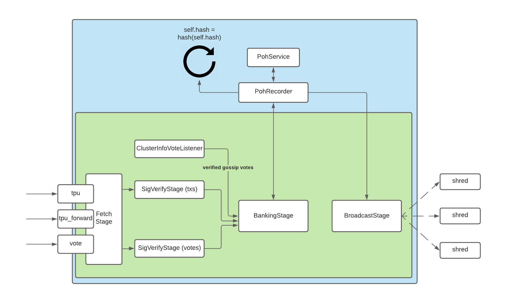
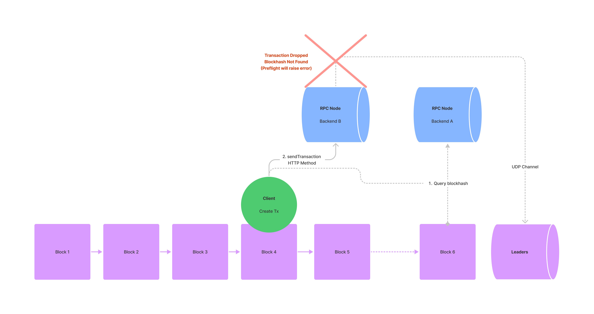
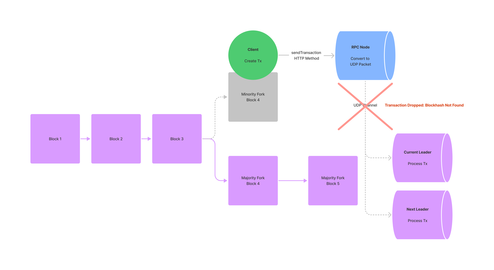
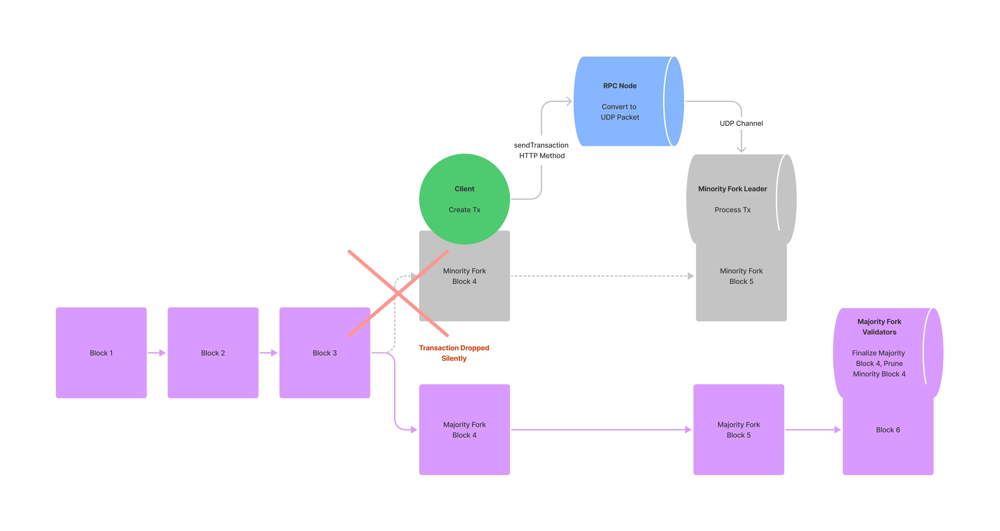

# Solana交易重试
> https://solana.com/docs/advanced/retry

- RPC节点会尝试重新广播
- 开发者可以实现自定义的重新广播逻辑
- 开发者可以利用 `sendTransaction`的 `maxRetries`参数
- 开发者在提交交易前，应该执行预检(preflight), 如: `simulattionTransaction`
- 在对重试交易进行签名交易前，**必须**确保之前那笔交易中的区块hash已经过期，
  - 否则存在发起2笔交易的风险

### 交易的流程

Solana**没有交易池(mempool, txpool)**, 所有的交易都会转发给leaders节点执行

Transaction Processing Unit (TPU) 处理交易的阶段：

- Fetch Stage
- SigVerify Stage
- Banking Stage
- Proof of History Service
- Broadcast Stage

### 交易被丢弃的几种情况

- 第1种： 开发者引用过期区块hash, 提交交易时被RPC pool丢弃 ，这种是最常见的
  

- 第2种： 临时分叉， 引用了被丢弃的分叉区块hash
  

- 第3种：  临时分叉， 引用了被丢弃的分叉区块hash
  

